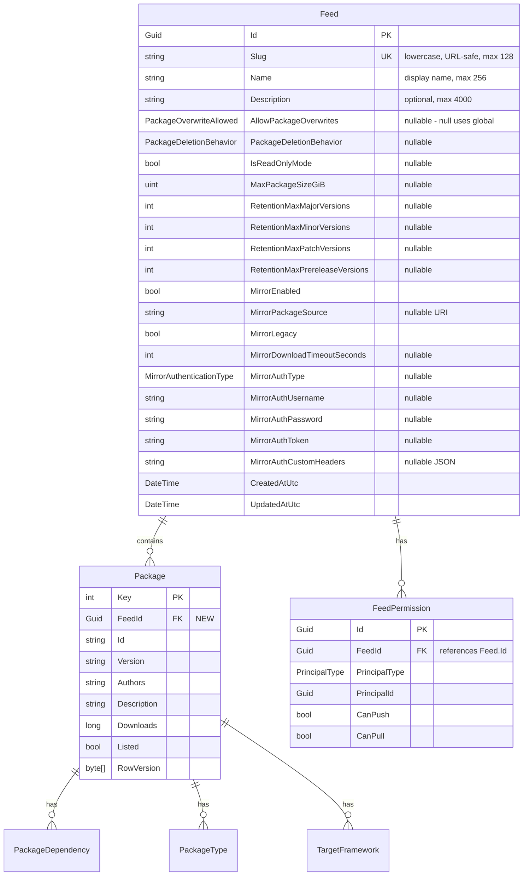
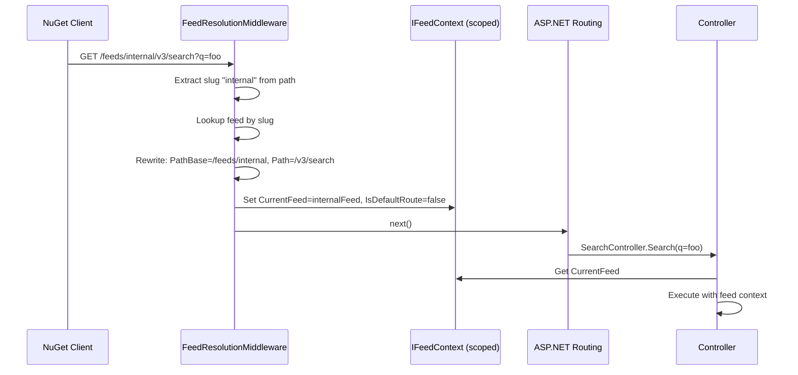
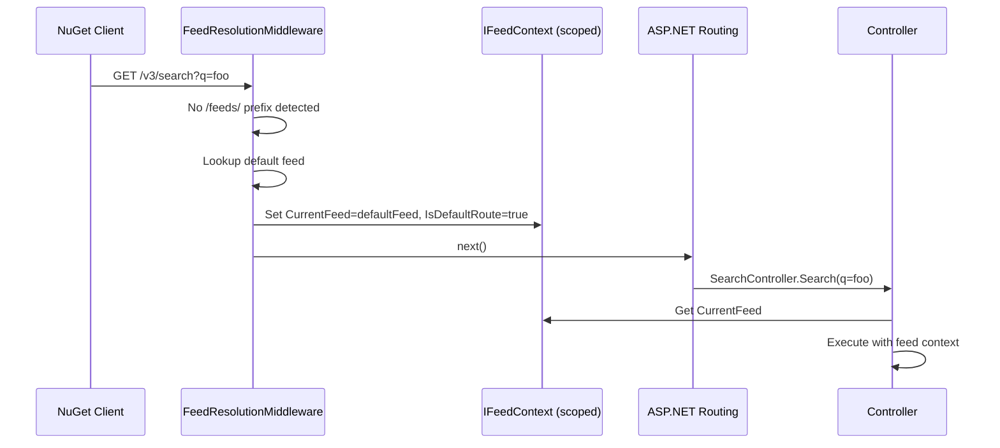

# Multi-Feed Support Implementation Plan (PLAT-671)

## 1. Overview

BaGetter is currently a single-feed NuGet server. All packages, storage, search, and permissions operate against a hardcoded `"default"` feed. This plan adds support for hosting multiple isolated NuGet feeds from a single BaGetter instance, so packages can be separated per team, customer, or purpose.

### Goals

- Each feed is a fully independent NuGet V3 endpoint with its own packages, storage, and settings
- Backward compatibility: existing root URLs (`/v3/index.json`, etc.) continue to work as the default feed
- Per-feed configurable settings (overwrite policy, retention, mirror, etc.) via WebUI
- Feed management through Admin UI and REST API
- Per-feed upstream mirroring from day one
- Package storage uses separate subfolders per feed (no deduplication)

### What Changes

| Layer | Current | After |
|-------|---------|-------|
| Data model | No Feed entity; Package has no feed association | `Feed` entity; `Package.FeedId` FK |
| URLs | `/v3/index.json` (global) | Root = default feed; `/feeds/{slug}/v3/index.json` = named feed |
| Storage | `packages/{id}/{version}/` | `packages/{feedSlug}/{id}/{version}/` |
| Search | Global query over all packages | Filtered by feed |
| Permissions | Hardcoded `"default"` string feed ID | `FeedPermission.FeedId` is Guid FK to `Feed.Id`, resolved from URL |
| Settings | Global only (`appsettings.json`) | Global defaults + per-feed overrides stored in DB |
| Mirroring | Single global upstream | Per-feed upstream configuration |

---

## 2. Key Architecture Decisions

| Decision | Choice | Rationale |
|----------|--------|-----------|
| Feed identifier in URLs | Path-based slug: `/feeds/{slug}/...` | Clean, standard (matches Azure DevOps Artifacts pattern), works with any reverse proxy |
| Backward compat | Root URLs map to default feed | Existing NuGet client configs keep working without changes |
| Default feed seeding | Startup check, auto-create if missing | Guarantees the default feed always exists |
| Package isolation | `(FeedId, Id, Version)` unique constraint | Same package ID+version can exist independently in different feeds |
| Storage isolation | Subfolder per feed slug | No deduplication; simple, predictable, easy to manage |
| Settings inheritance | Nullable per-feed overrides; null = use global | Clean override pattern; UI shows "Use global default" option |
| FeedPermission.FeedId | Change from `string` to `Guid` referencing `Feed.Id` | Proper FK relationship; migration looks up the default feed's Guid by slug to convert existing records |
| Feed context propagation | `IFeedContext` (scoped) + explicit `feedId` params on data layer | Middleware sets context; data services are explicit and testable |

---

## 3. URL Structure

### Default Feed (backward compatible)

All existing URLs continue to work unchanged, mapped to the default feed:

```
GET   /v3/index.json
PUT   /api/v2/package
GET   /v3/search
GET   /v3/registration/{id}/index.json
GET   /v3/package/{id}/{version}/{idVersion}.nupkg
...etc (all current endpoints)
```

### Named Feed

All the above endpoints are also available under `/feeds/{slug}/`:

```
GET   /feeds/{slug}/v3/index.json
PUT   /feeds/{slug}/api/v2/package
GET   /feeds/{slug}/v3/search
...etc
```

### Feed Management API (Admin)

```
GET    /api/v1/feeds                → List all feeds
GET    /api/v1/feeds/{slug}         → Get feed details + settings
POST   /api/v1/feeds                → Create feed
PUT    /api/v1/feeds/{slug}         → Update feed settings
DELETE /api/v1/feeds/{slug}         → Delete feed (non-default only)
```

### Web UI

```
/                                  → Default feed package browser (unchanged)
/feeds/{slug}                      → Named feed package browser
/Admin/Feeds                       → Feed management page
/Admin/Feeds/{slug}/Settings       → Per-feed settings editor
```

---

## 4. Data Model Changes

### New Entity: Feed



### Package Entity Changes

- Add `Guid FeedId` (FK to Feed) and `Feed` navigation property
- Change unique constraint from `(Id, Version)` to `(FeedId, Id, Version)`
- Update index on `Id` to `(FeedId, Id)` for efficient per-feed queries

### FeedPermission Entity Changes

`FeedPermission.FeedId` changes from `string` to `Guid`, becoming a proper FK to `Feed.Id`. The migration must:
1. Create a temporary Guid column
2. Map existing `"default"` string values to the default feed's Guid (looked up via `SELECT Id FROM Feeds WHERE Slug = 'default'`)
3. Drop the old string column and rename the new one
4. Add the FK constraint and update the unique index to `(FeedId, PrincipalType, PrincipalId)`

The `IPermissionService` methods change their `string feedId` parameter to `Guid feedId`. Callers (controllers, `FeedPermissionHandler`) pass `_feedContext.CurrentFeed.Id` instead of the feed slug.

The `Feed` entity gains a `List<FeedPermission> Permissions` navigation property.

### AbstractContext Changes

- Add `DbSet<Feed> Feeds` property
- Add `BuildFeedEntity` configuration in `OnModelCreating`
- Update `BuildPackageEntity` with new indexes

---

## 5. Feed Resolution Layer

### Request Flow





### IFeedContext

A scoped service set by middleware providing:
- `Feed CurrentFeed` — the resolved feed for the current request (never null after middleware)
- `bool IsDefaultRoute` — whether the request came in on root URLs (controls URL generation)

### PathBase Trick for URL Generation

By setting `PathBase` to `/feeds/{slug}` in middleware, the existing `BaGetterUrlGenerator` (which uses ASP.NET `LinkGenerator`) automatically produces correct feed-scoped URLs in service index responses — **no code changes needed** in `BaGetterUrlGenerator`.

### Default Feed Seeding

On every startup (after migrations), `IFeedService.EnsureDefaultFeedExistsAsync()` checks if a feed with slug `"default"` exists. If not, it creates one with a normal auto-generated Guid. The slug `"default"` is the stable identifier — code always looks up by slug via `Feed.DefaultSlug` constant, never by a hardcoded Guid.

---

## 6. Core Service Architecture

### Class Relationships


### Changes to Existing Service Interfaces


### Per-Feed Settings Resolution

Each setting on the `Feed` entity is nullable. The `IFeedSettingsResolver` checks the feed's value first; if null, falls back to the global value from `IOptionsSnapshot<BaGetterOptions>`. The UI shows a "Use global default" checkbox per setting.

### Per-Feed Mirroring

`IUpstreamClientFactory` replaces the single `IUpstreamClient` in DI. It creates the appropriate V2/V3 upstream client based on each feed's mirror settings, or returns `NullUpstreamClient` if mirroring is disabled. Clients are cached by feed ID.

`PackageService` uses the factory: on cache-miss, it calls `_upstreamFactory.CreateForFeed(feed)` to get the right client for the current feed.

### Symbol Storage/Indexing

`ISymbolStorageService` and `ISymbolIndexingService` follow the same pattern — gain a `feedSlug` parameter. Symbol files stored under `symbols/{feedSlug}/{file}/{key}/{file2}`.

---

## 7. Authentication & Authorization Changes

### FeedPermissionHandler

Replace the hardcoded `DefaultFeedId = "default"` with `_feedContext.CurrentFeed.Id` (Guid). The handler already receives the permission type (Pull/Push/Admin); now it uses the resolved feed's Guid from the request context. `IPermissionService.CanPushAsync` and `CanPullAsync` change their `string feedId` parameter to `Guid feedId`.

### Controller Auth

`PackagePublishController` and `SymbolController` have private `AuthorizePushAsync` methods that hardcode `DefaultFeedId`. These switch to `_feedContext.CurrentFeed.Id`. No structural change — just replacing the constant with the feed context value.

---

## 8. Web UI Changes

### Feed Management (Admin)

**New page `Admin/Feeds`**: List all feeds (slug, name, package count, created date). Create/edit/delete feeds. Cannot delete the default feed.

**New page `Admin/FeedSettings`**: Per-feed settings editor with sections:
- **General**: Name, description, read-only mode
- **Package Behavior**: Overwrite policy, deletion behavior, max package size
- **Retention**: Max versions per major/minor/patch/prerelease
- **Mirror**: Enable/disable, package source URL, v2/v3, timeout, authentication

Each setting shows a "Use global default" checkbox. When unchecked, the per-feed value becomes editable.

### Feed-Scoped Package Views

Existing Razor pages become feed-aware:
- **Index/Package/Upload/Statistics**: Get current feed from `IFeedContext`, scope queries and links accordingly
- **Layout**: Add a feed selector dropdown in nav bar (hidden when only default feed exists)

---

## 9. Database Migration Strategy

### Migration Steps

1. **Create `Feeds` table** with all columns
2. **Seed default feed** with slug `"default"` and an auto-generated Guid (using `NEWID()` / `randomblob()` depending on provider)
3. **Add `FeedId` column to `Packages`** as nullable Guid, backfill all existing rows with `(SELECT Id FROM Feeds WHERE Slug = 'default')`, then make it non-nullable. Add FK to `Feeds.Id`
4. **Drop old unique constraint** `(Id, Version)`, create new one `(FeedId, Id, Version)`
5. **Migrate `FeedPermission.FeedId`** from `string` to `Guid`: add a new Guid column, map existing `"default"` values to the default feed's Guid via subquery, drop the old string column, rename, add FK to `Feeds.Id`, recreate unique index `(FeedId, PrincipalType, PrincipalId)`

### Creating Migrations

Migrations **must** be generated using the `dotnet ef` CLI — do not write migration files by hand. After making entity/context changes, run for each database provider:

```bash
dotnet ef migrations add AddMultiFeedSupport --project src/BaGetter.Database.Sqlite --startup-project src/BaGetter
dotnet ef migrations add AddMultiFeedSupport --project src/BaGetter.Database.SqlServer --startup-project src/BaGetter
dotnet ef migrations add AddMultiFeedSupport --project src/BaGetter.Database.PostgreSql --startup-project src/BaGetter
dotnet ef migrations add AddMultiFeedSupport --project src/BaGetter.Database.MySql --startup-project src/BaGetter
```

The generated migration will need manual editing to add the data migration step (backfilling `FeedId` on existing packages and seeding the default feed row). This is the only acceptable hand-edit to migration files.

### Storage Migration

Existing files at `packages/{id}/{version}/` need to be under `packages/default/{id}/{version}/`.

**Approach**: Compatibility fallback — if a file isn't found at `packages/{feedSlug}/{id}/{version}/...`, also check the legacy path `packages/{id}/{version}/...`. This allows zero-downtime upgrades without a separate migration step. Mark the fallback for removal in a future version.

For **file storage**: Optionally move directories at startup.
For **cloud storage**: The fallback avoids expensive object-copy operations.

### Global Mirror Config Migration

On first startup after migration, if the global `Mirror` config has `Enabled = true`, copy those settings to the default feed's mirror columns in the DB. This preserves existing mirror behavior.

---

## 10. Implementation Phases

### Phase 1: Data Foundation
Feed entity, Package.FeedId, database migration, default feed seeding.

**Files**: `Feed.cs` (new), `Package.cs`, `AbstractContext.cs`, EF migrations per provider, `IFeedService`/`FeedService` (new), `Program.cs`

**Verify**: Build passes, migrations apply, default feed exists after startup.

### Phase 2: Feed Resolution & Context
Middleware resolves feed from URL, scoped `IFeedContext` available to all services.

**Files**: `IFeedContext`/`FeedContext` (new), `FeedResolutionMiddleware` (new), `Startup.cs`

**Verify**: Root URLs resolve default feed; `/feeds/{slug}/` resolves named feed; unknown slugs → 404.

### Phase 3: Core Service Changes — Data Layer
All package data operations are feed-scoped.

**Files**: `IPackageDatabase`, `PackageDatabase`, `DatabaseSearchService`, `ISearchService`, `IPackageContentService`, `IPackageMetadataService` + implementations

**Verify**: Same package ID in different feeds is independent.

### Phase 4: Storage Changes
Package files stored under feed-specific subdirectories with legacy fallback.

**Files**: `IPackageStorageService`, `PackageStorageService`, `ISymbolStorageService`, symbol storage impl

**Verify**: New packages at `packages/{feedSlug}/...`. Legacy path fallback works.

### Phase 5: Indexing & Deletion Pipeline
Package indexing and deletion are feed-aware.

**Files**: `IPackageIndexingService`, `PackageIndexingService`, `IPackageDeletionService`, `PackageDeletionService`, `ISymbolIndexingService`

**Verify**: Push a package to a specific feed; correct storage and indexing.

### Phase 6: Controller Integration
All NuGet protocol controllers use `IFeedContext`.

**Files**: All controllers (`ServiceIndex`, `PackagePublish`, `PackageContent`, `PackageMetadata`, `Search`, `Symbol`)

**Verify**: End-to-end NuGet operations via root URLs and `/feeds/{slug}/` URLs.

### Phase 7: Authentication & Authorization
Permission checks use dynamic feed slug.

**Files**: `FeedPermissionHandler`, `PackagePublishController`, `SymbolController`

**Verify**: Users with push on feed A cannot push to feed B.

### Phase 8: Per-Feed Settings
Feed settings override global config.

**Files**: `IFeedSettingsResolver`/`FeedSettingsResolver` (new), `PackageIndexingService`, other services reading from `BaGetterOptions`

**Verify**: Per-feed overwrite policy and retention work independently.

### Phase 9: Per-Feed Mirroring
Each feed can mirror a different upstream source.

**Files**: `IUpstreamClientFactory`/`UpstreamClientFactory` (new), `PackageService`, startup mirror config migration

**Verify**: Feed A mirrors nuget.org; Feed B has mirroring disabled.

### Phase 10: Web UI — Feed Management
Admin CRUD for feeds and per-feed settings.

**Files**: `Admin/Feeds.cshtml` (new), `Admin/FeedSettings.cshtml` (new), `_Layout.cshtml`

**Verify**: Full feed CRUD; settings editable with "Use global default" option.

### Phase 11: Web UI — Feed-Scoped Views
Package browser, details, upload, and stats are feed-aware.

**Files**: `Index.cshtml`, `Package.cshtml`, `Upload.cshtml`, `Statistics.cshtml` + code-behind files

**Verify**: Navigating between feeds shows different packages.

### Phase 12: Feed Management REST API
Programmatic feed management.

**Files**: `FeedController.cs` (new)

**Verify**: CRUD via API with proper auth enforcement.

### Phase 13: Dead Code Cleanup
Remove code that becomes orphaned after multi-feed implementation.

Known dead code to remove:
- `private const string DefaultFeedId = "default"` in `PackagePublishController`, `SymbolController`, and `FeedPermissionHandler` — replaced by `IFeedContext.CurrentFeed.Id`
- The single `IUpstreamClient` DI registration in startup — replaced by `IUpstreamClientFactory`
- Global `MirrorOptions` binding if all mirror config moves to per-feed DB storage (evaluate whether to keep as fallback defaults)
- Any direct `IOptionsSnapshot<BaGetterOptions>` usage in services that now use `IFeedSettingsResolver` for feed-scoped settings (e.g., overwrite policy, retention, read-only mode reads in `PackageIndexingService`)
- Unused `string feedId` overloads on `IPermissionService` after the parameter type changes to `Guid`

Each phase should verify no orphaned imports, unused parameters, or unreachable code paths are left behind. Run `dotnet build` with warnings-as-errors to catch unused variables.

### Phase 14: Integration Tests & Polish
Comprehensive test coverage for all phases.

Key scenarios: default feed backward compat, named feed operations, feed isolation, per-feed settings, per-feed mirroring, permission enforcement, storage paths, service index URLs, upgrade migration.

---

## Appendix: Files Changed Summary

### New Files

| File | Purpose |
|------|---------|
| `src/BaGetter.Core/Entities/Feed.cs` | Feed entity |
| `src/BaGetter.Core/Feeds/IFeedService.cs` | Feed CRUD interface |
| `src/BaGetter.Core/Feeds/FeedService.cs` | Feed CRUD implementation |
| `src/BaGetter.Core/Feeds/IFeedContext.cs` | Current request feed context interface |
| `src/BaGetter.Core/Feeds/FeedContext.cs` | Mutable scoped implementation |
| `src/BaGetter.Core/Feeds/IFeedSettingsResolver.cs` | Per-feed settings resolution interface |
| `src/BaGetter.Core/Feeds/FeedSettingsResolver.cs` | Implementation |
| `src/BaGetter.Core/Upstream/IUpstreamClientFactory.cs` | Per-feed upstream client factory |
| `src/BaGetter.Core/Upstream/UpstreamClientFactory.cs` | Implementation |
| `src/BaGetter.Web/Middleware/FeedResolutionMiddleware.cs` | URL-to-feed resolution |
| `src/BaGetter.Web/Controllers/FeedController.cs` | Feed management REST API |
| `src/BaGetter.Web/Pages/Admin/Feeds.cshtml` | Feed management UI |
| `src/BaGetter.Web/Pages/Admin/FeedSettings.cshtml` | Per-feed settings UI |
| `src/BaGetter.Database.*/Migrations/...` | DB migrations per provider |

### Modified Files

| File | Change |
|------|--------|
| `src/BaGetter.Core/Entities/Package.cs` | Add FeedId, Feed navigation |
| `src/BaGetter.Core/Entities/AbstractContext.cs` | Add Feeds DbSet, update model config |
| `src/BaGetter.Core/IPackageDatabase.cs` | Add feedId params to all methods |
| `src/BaGetter.Core/PackageDatabase.cs` | Filter all queries by feedId |
| `src/BaGetter.Core/Search/DatabaseSearchService.cs` | Filter by feedId |
| `src/BaGetter.Core/Search/ISearchService.cs` | Add FeedId to request models |
| `src/BaGetter.Core/Storage/IPackageStorageService.cs` | Add feedSlug param |
| `src/BaGetter.Core/Storage/PackageStorageService.cs` | Feed-prefixed paths |
| `src/BaGetter.Core/Indexing/IPackageIndexingService.cs` | Add feed params |
| `src/BaGetter.Core/Indexing/PackageIndexingService.cs` | Feed-aware indexing |
| `src/BaGetter.Core/Indexing/IPackageDeletionService.cs` | Add feed params |
| `src/BaGetter.Core/Content/IPackageContentService.cs` | Add feed params |
| `src/BaGetter.Core/Metadata/IPackageMetadataService.cs` | Add feed params |
| `src/BaGetter.Core/PackageService.cs` | Per-feed mirroring |
| `src/BaGetter.Web/Controllers/*.cs` | Use IFeedContext (all 6 controllers) |
| `src/BaGetter.Core/Entities/FeedPermission.cs` | FeedId from string to Guid FK |
| `src/BaGetter.Core/Authentication/IPermissionService.cs` | feedId param from string to Guid |
| `src/BaGetter.Core/Authentication/PermissionService.cs` | feedId param from string to Guid |
| `src/BaGetter.Web/Authentication/FeedPermissionHandler.cs` | Dynamic feed Guid from IFeedContext |
| `src/BaGetter.Web/Pages/*.cshtml` | Feed-scoped views (Index, Package, Upload, Statistics) |
| `src/BaGetter.Web/Pages/Shared/_Layout.cshtml` | Feed selector in nav |
| `src/BaGetter/Startup.cs` | Register feed services, middleware |
| `src/BaGetter/Program.cs` | Default feed seeding |

---

## 11. Task Breakdown & Dependencies

Each task is identified by `<phase>.<task>` (e.g. `1.4`). The `Depends on` column lists the tasks that must complete first.

Each task lists the file(s) to touch, dependencies, and a concrete description of what to do. File paths are relative to repo root.

### Phase 1 — Data Foundation

#### 1.1 Create `Feed` entity
- **File**: `src/BaGetter.Core/Entities/Feed.cs` *(new)*
- **Depends on**: —
- **Description**: Add an entity class `Feed` in namespace `BaGetter.Core.Entities` with: `Guid Id` (PK), `string Slug` (unique, max 128, lowercase URL-safe), `string Name` (max 256), `string Description` (nullable, max 4000). All settings overrides nullable: `PackageOverwriteAllowed? AllowPackageOverwrites`, `PackageDeletionBehavior? PackageDeletionBehavior`, `bool? IsReadOnlyMode`, `uint? MaxPackageSizeGiB`, `int? RetentionMaxMajorVersions`, `int? RetentionMaxMinorVersions`, `int? RetentionMaxPatchVersions`, `int? RetentionMaxPrereleaseVersions`. Mirror columns: `bool MirrorEnabled`, `string MirrorPackageSource` (nullable URI string), `bool MirrorLegacy`, `int? MirrorDownloadTimeoutSeconds`, `MirrorAuthenticationType? MirrorAuthType`, `string MirrorAuthUsername`, `string MirrorAuthPassword`, `string MirrorAuthToken`, `string MirrorAuthCustomHeaders` (nullable JSON-serialized dictionary). Audit: `DateTime CreatedAtUtc`, `DateTime UpdatedAtUtc`. Navigation properties: `List<Package> Packages = new()` and `List<FeedPermission> Permissions = new()`. Add `public const string DefaultSlug = "default";` as a static constant — code must look the default feed up by slug, never by a hardcoded Guid. Match the file-scoped namespace style used in `User.cs`.

#### 1.2 Add `FeedId` to `Package`
- **File**: `src/BaGetter.Core/Entities/Package.cs`
- **Depends on**: 1.1
- **Description**: Add `Guid FeedId { get; set; }` and `Feed Feed { get; set; }` navigation property to the existing `Package` class. Place near the top of the property list (before `Id`) to make the per-feed scope obvious in code review.

#### 1.3 Update `AbstractContext` for Feeds
- **File**: `src/BaGetter.Core/Entities/AbstractContext.cs`
- **Depends on**: 1.1, 1.2
- **Description**: Add `public DbSet<Feed> Feeds { get; set; }` next to the other `DbSet` properties. Add a `private void BuildFeedEntity(EntityTypeBuilder<Feed> feed)` method modeled on `BuildUserEntity` configuring: PK on `Id`, unique index on `Slug`, max lengths (Slug 128, Name 256, Description 4000), nullable enum/int columns. In `BuildPackageEntity`, add `package.HasOne(p => p.Feed).WithMany(f => f.Packages).HasForeignKey(p => p.FeedId).OnDelete(DeleteBehavior.Cascade);` and a non-unique index `package.HasIndex(p => new { p.FeedId, p.Id });`. Drop the existing `(Id, NormalizedVersionString)` unique constraint and replace with `(FeedId, Id, NormalizedVersionString)`. Wire the new builder in `OnModelCreating`: `builder.Entity<Feed>(BuildFeedEntity);`.

#### 1.4 Create `IFeedService` / `FeedService`
- **Files**:
  - `src/BaGetter.Core/Feeds/IFeedService.cs` *(new)*
  - `src/BaGetter.Core/Feeds/FeedService.cs` *(new)*
- **Depends on**: 1.1, 1.3
- **Description**: Interface methods: `Task<Feed> GetDefaultFeedAsync(CancellationToken)`, `Task<Feed> GetFeedBySlugAsync(string slug, CancellationToken)`, `Task<IReadOnlyList<Feed>> GetAllFeedsAsync(CancellationToken)`, `Task<Feed> CreateFeedAsync(Feed feed, CancellationToken)`, `Task<Feed> UpdateFeedAsync(Feed feed, CancellationToken)`, `Task<bool> DeleteFeedAsync(Guid feedId, CancellationToken)`, `Task EnsureDefaultFeedExistsAsync(CancellationToken)`. Implementation depends on `IContext` (constructor inject). `EnsureDefaultFeedExistsAsync`: lookup by `Feed.DefaultSlug`; if missing, insert with `Id = Guid.NewGuid()`, `Slug = Feed.DefaultSlug`, `Name = "Default"`, mirror disabled, timestamps `DateTime.UtcNow`. `DeleteFeedAsync` must throw `InvalidOperationException` when target slug equals `Feed.DefaultSlug`. Validate slug in Create/Update with regex `^[a-z0-9](?:[a-z0-9-]{0,126}[a-z0-9])?$` (lowercase, no leading/trailing hyphens, max 128). Register in DI in `DependencyInjectionExtensions.AddBaGetServices` via `services.TryAddScoped<IFeedService, FeedService>();`.

#### 1.5 Generate EF migrations (all four providers)
- **Files**:
  - `src/BaGetter.Database.Sqlite/Migrations/<timestamp>_AddMultiFeedSupport.cs` *(new)*
  - `src/BaGetter.Database.SqlServer/Migrations/<timestamp>_AddMultiFeedSupport.cs` *(new)*
  - `src/BaGetter.Database.PostgreSql/Migrations/<timestamp>_AddMultiFeedSupport.cs` *(new)*
  - `src/BaGetter.Database.MySql/Migrations/<timestamp>_AddMultiFeedSupport.cs` *(new)*
- **Depends on**: 1.3, 7.1
- **Description**: Run for each provider:
  ```bash
  dotnet ef migrations add AddMultiFeedSupport --project src/BaGetter.Database.Sqlite --startup-project src/BaGetter
  dotnet ef migrations add AddMultiFeedSupport --project src/BaGetter.Database.SqlServer --startup-project src/BaGetter
  dotnet ef migrations add AddMultiFeedSupport --project src/BaGetter.Database.PostgreSql --startup-project src/BaGetter
  dotnet ef migrations add AddMultiFeedSupport --project src/BaGetter.Database.MySql --startup-project src/BaGetter
  ```
  Naming follows existing pattern `<utc-timestamp>_AddMultiFeedSupport.cs` (see latest `20260408_AddAuthEntities`). Do NOT hand-write the migration scaffold — only the data-step in 1.6 may be hand-edited. The scaffolded migration must include: create `Feeds` table; add nullable `FeedId` column to `Packages`; add new Guid `FeedId` column to `FeedPermissions` (the old string column will be migrated in 1.6); drop old `Packages` unique index; create new `(FeedId, Id, NormalizedVersionString)` unique index and `(FeedId, Id)` lookup index; FK `Packages.FeedId → Feeds.Id` and `FeedPermissions.FeedId → Feeds.Id`; recreate `FeedPermissions` unique index `(FeedId, PrincipalType, PrincipalId)`.

#### 1.6 Hand-edit migrations: seed + backfill + permission map
- **Files**: same four migration files from 1.5.
- **Depends on**: 1.5
- **Description**: This is the one acceptable hand-edit. Insert these `migrationBuilder.Sql(...)` calls at the right ordinal positions inside `Up()`:
  1. After `Feeds` table creation: `INSERT INTO Feeds (Id, Slug, Name, MirrorEnabled, MirrorLegacy, CreatedAtUtc, UpdatedAtUtc) VALUES (<NEWID()-equivalent per provider>, 'default', 'Default', 0, 0, <current UTC>, <current UTC>);` — use provider-appropriate Guid generator: SQL Server `NEWID()`; SQLite `lower(hex(randomblob(16)))` formatted as Guid string; PostgreSQL `gen_random_uuid()` (requires `pgcrypto` — use `uuid_generate_v4()` or check existing Guid generation in prior migrations); MySQL `UUID()`.
  2. Backfill Packages: `UPDATE Packages SET FeedId = (SELECT Id FROM Feeds WHERE Slug = 'default') WHERE FeedId IS NULL;` then `ALTER TABLE Packages ALTER COLUMN FeedId <Guid NOT NULL>` (provider-specific syntax).
  3. Migrate `FeedPermissions.FeedId` from string→Guid: copy the new Guid column with `UPDATE FeedPermissions SET FeedIdNew = (SELECT Id FROM Feeds WHERE Slug = FeedPermissions.FeedId);` then drop the old string column and rename.
  Add corresponding `Down()` reversal where feasible (delete the inserted default-feed row).

#### 1.7 Wire `EnsureDefaultFeedExistsAsync` at startup
- **File**: `src/BaGetter/Program.cs`
- **Depends on**: 1.4
- **Description**: In the `OnExecuteAsync` block where `host.RunMigrationsAsync()` is called (today around the command setup), after migrations run, resolve `IFeedService` from a scoped service provider and `await feedService.EnsureDefaultFeedExistsAsync(token)`. Use `host.Services.CreateScope()` for the lookup — `IFeedService` is scoped.

---

### Phase 2 — Feed Resolution & Context

#### 2.1 Create `IFeedContext` / `FeedContext`
- **Files**:
  - `src/BaGetter.Core/Feeds/IFeedContext.cs` *(new)*
  - `src/BaGetter.Core/Feeds/FeedContext.cs` *(new)*
- **Depends on**: 1.1
- **Description**: Interface with two properties: `Feed CurrentFeed { get; }` and `bool IsDefaultRoute { get; }`. Add an internal/explicit setter or a `Set(Feed feed, bool isDefaultRoute)` method on the implementation only — not on the interface — so only the middleware can populate it. Implementation is a plain mutable POCO. Register as `services.TryAddScoped<IFeedContext, FeedContext>();` (and additionally as `services.TryAddScoped<FeedContext>();` if you choose to inject the concrete type into middleware). Place registration in `DependencyInjectionExtensions.AddBaGetServices`.

#### 2.2 Create `FeedResolutionMiddleware`
- **File**: `src/BaGetter.Web/Middleware/FeedResolutionMiddleware.cs` *(new)*
- **Depends on**: 1.4, 2.1
- **Description**: ASP.NET middleware (constructor `(RequestDelegate next)`, `InvokeAsync(HttpContext context, IFeedService feedService, IFeedContext feedContext)`). Logic:
  1. If `context.Request.Path.StartsWithSegments("/feeds", out var remaining)`: extract slug from the next segment (`remaining.Value` first segment). Look up via `feedService.GetFeedBySlugAsync(slug, ct)`. If null → respond `404 Not Found` and short-circuit. Otherwise mutate `context.Request.PathBase = context.Request.PathBase.Add($"/feeds/{slug}")`, `context.Request.Path = remaining-after-slug`, populate `feedContext.Set(feed, isDefaultRoute: false)`.
  2. Else (root URLs): call `feedService.GetDefaultFeedAsync(ct)` and populate `feedContext.Set(default, isDefaultRoute: true)`. Do NOT modify `PathBase`.
  3. `await _next(context);`
  Keep the middleware allocation-light — most requests will be the default route. The `PathBase` mutation is what makes existing `BaGetterUrlGenerator` produce feed-scoped URLs without code changes.

#### 2.3 Register middleware + services in `Startup.cs`
- **File**: `src/BaGetter/Startup.cs`
- **Depends on**: 2.2
- **Description**: In `Configure`, insert `app.UseMiddleware<FeedResolutionMiddleware>();` AFTER `app.UseRouting()` but BEFORE `app.UseAuthorization()` (so the feed context exists when `FeedPermissionHandler` runs) and before `UseEndpoints`. Confirm `IFeedContext`, `IFeedService`, and the middleware type itself are resolvable. Verify nothing else mutates `PathBase` after it (the existing `app.UsePathBase(options.PathBase)` runs earlier — that is fine).

---

### Phase 3 — Core Service Changes — Data Layer

#### 3.1 Add `Guid feedId` to `IPackageDatabase`
- **File**: `src/BaGetter.Core/IPackageDatabase.cs`
- **Depends on**: 1.2
- **Description**: Add `Guid feedId` as the first parameter of every method except `AddAsync` (which reads `package.FeedId` directly). Final shape:
  ```csharp
  Task<PackageAddResult> AddAsync(Package package, CancellationToken ct);
  Task<bool> ExistsAsync(Guid feedId, string id, CancellationToken ct);
  Task<bool> ExistsAsync(Guid feedId, string id, NuGetVersion version, CancellationToken ct);
  Task<IReadOnlyList<Package>> FindAsync(Guid feedId, string id, bool includeUnlisted, CancellationToken ct);
  Task<Package> FindOrNullAsync(Guid feedId, string id, NuGetVersion version, bool includeUnlisted, CancellationToken ct);
  Task<bool> UnlistPackageAsync(Guid feedId, string id, NuGetVersion version, CancellationToken ct);
  Task<bool> RelistPackageAsync(Guid feedId, string id, NuGetVersion version, CancellationToken ct);
  Task AddDownloadAsync(Guid feedId, string id, NuGetVersion version, CancellationToken ct);
  Task<bool> HardDeletePackageAsync(Guid feedId, string id, NuGetVersion version, CancellationToken ct);
  ```

#### 3.2 Update `PackageDatabase` implementation
- **File**: `src/BaGetter.Core/PackageDatabase.cs`
- **Depends on**: 3.1
- **Description**: Add `.Where(p => p.FeedId == feedId)` to every query (Find/Exists/Unlist/Relist/AddDownload/HardDelete). For `AddAsync`: trust `package.FeedId` (set by the caller). The `DbUpdateException` translation logic for the unique constraint is unchanged in shape — the new constraint is on `(FeedId, Id, NormalizedVersionString)`, so the existing duplicate-detection still works without behavioral change.

#### 3.3 Add `FeedId` to search/autocomplete request models
- **Files**:
  - `src/BaGetter.Core/Search/SearchRequest.cs`
  - `src/BaGetter.Core/Search/AutocompleteRequest.cs`
  - `src/BaGetter.Core/Search/VersionsRequest.cs`
  - `src/BaGetter.Core/Search/ISearchService.cs`
- **Depends on**: 1.2
- **Description**: Add `Guid FeedId { get; set; }` to all three request classes. Change `FindDependentsAsync` signature to `Task<DependentsResponse> FindDependentsAsync(Guid feedId, string packageId, CancellationToken ct)`. The other interface methods already take request objects, so their signatures are unchanged — only the request payloads grow a new field.

#### 3.4 Update `DatabaseSearchService`
- **File**: `src/BaGetter.Core/Search/DatabaseSearchService.cs`
- **Depends on**: 3.3
- **Description**: In every LINQ query against `_context.Packages`, add `.Where(p => p.FeedId == request.FeedId)` (or `feedId` for `FindDependentsAsync`). This includes the search results query, autocomplete query, version listing, and dependents lookup.

#### 3.5 Add feed params to content/metadata interfaces
- **Files**:
  - `src/BaGetter.Core/Content/IPackageContentService.cs`
  - `src/BaGetter.Core/Metadata/IPackageMetadataService.cs`
- **Depends on**: 3.1
- **Description**: Both interfaces need a `Guid feedId` parameter (and `IPackageContentService` also needs `string feedSlug` because it triggers storage reads). Final content shape:
  ```csharp
  Task<PackageVersionsResponse> GetPackageVersionsOrNullAsync(Guid feedId, string feedSlug, string id, CancellationToken ct);
  Task<Stream> GetPackageContentStreamOrNullAsync(Guid feedId, string feedSlug, string id, NuGetVersion version, CancellationToken ct);
  Task<Stream> GetPackageManifestStreamOrNullAsync(Guid feedId, string feedSlug, string id, NuGetVersion version, CancellationToken ct);
  Task<Stream> GetPackageReadmeStreamOrNullAsync(Guid feedId, string feedSlug, string id, NuGetVersion version, CancellationToken ct);
  Task<Stream> GetPackageIconStreamOrNullAsync(Guid feedId, string feedSlug, string id, NuGetVersion version, CancellationToken ct);
  ```
  Metadata only needs `feedId`:
  ```csharp
  Task<BaGetterRegistrationIndexResponse> GetRegistrationIndexOrNullAsync(Guid feedId, string id, CancellationToken ct = default);
  Task<RegistrationLeafResponse> GetRegistrationLeafOrNullAsync(Guid feedId, string id, NuGetVersion version, CancellationToken ct = default);
  ```

#### 3.6 Update content/metadata implementations
- **Files**:
  - `src/BaGetter.Core/Content/DefaultPackageContentService.cs`
  - `src/BaGetter.Core/Metadata/DefaultPackageMetadataService.cs`
- **Depends on**: 3.5
- **Description**: Forward the new params to `IPackageService` / `IPackageDatabase` / `IPackageStorageService`. `IPackageService` itself (`src/BaGetter.Core/IPackageService.cs` and `PackageService.cs`) gains `Guid feedId` on its lookup methods (`FindPackageVersionsAsync`, `FindPackagesAsync`, `FindPackageOrNullAsync`, `ExistsAsync`, `AddDownloadAsync`); see also Phase 9 for the upstream/mirror integration. `MirrorAsync` becomes feed-aware in Phase 9.

---

### Phase 4 — Storage

#### 4.1 Add `string feedSlug` to `IPackageStorageService`
- **File**: `src/BaGetter.Core/Storage/IPackageStorageService.cs`
- **Depends on**: —
- **Description**: Add `string feedSlug` as the first parameter of every method:
  ```csharp
  Task SavePackageContentAsync(string feedSlug, Package package, Stream packageStream, Stream nuspecStream, Stream readmeStream, Stream iconStream, CancellationToken ct);
  Task<Stream> GetPackageStreamAsync(string feedSlug, string id, NuGetVersion version, CancellationToken ct);
  Task<Stream> GetNuspecStreamAsync(string feedSlug, string id, NuGetVersion version, CancellationToken ct);
  Task<Stream> GetReadmeStreamAsync(string feedSlug, string id, NuGetVersion version, CancellationToken ct);
  Task<Stream> GetIconStreamAsync(string feedSlug, string id, NuGetVersion version, CancellationToken ct);
  Task DeleteAsync(string feedSlug, string id, NuGetVersion version, CancellationToken ct);
  ```

#### 4.2 Update `PackageStorageService` with feed-prefixed paths + legacy fallback
- **File**: `src/BaGetter.Core/Storage/PackageStorageService.cs`
- **Depends on**: 4.1
- **Description**: Refactor the private path-builder helpers to prepend `feedSlug` between `PackagesPathPrefix` and the package id segment, e.g. `packages/{feedSlug}/{id-lower}/{version-lower}/{file}`. On every Get*StreamAsync, attempt the new path first; if `_storage.GetAsync` returns null/`StorageResult.NotFound`, attempt the legacy path `packages/{id-lower}/{version-lower}/{file}` only when `feedSlug == Feed.DefaultSlug` (legacy storage was unscoped — only the default feed's files could be there). Mark the fallback with a `// TODO(multi-feed): remove legacy path fallback in vNext` comment so it's easy to find later. `DeleteAsync` does not need legacy fallback — only deletes the new path.

#### 4.3 Same pattern for symbol storage
- **Files**:
  - `src/BaGetter.Core/Storage/ISymbolStorageService.cs`
  - `src/BaGetter.Core/Storage/SymbolStorageService.cs`
- **Depends on**: 4.1
- **Description**: Add `string feedSlug` to `SavePortablePdbContentAsync` and `GetPortablePdbContentStreamOrNullAsync`. Path becomes `symbols/{feedSlug}/{file}/{key}/{file2}`. Apply the same default-feed-only legacy-path fallback on read.

---

### Phase 5 — Indexing & Deletion Pipeline

#### 5.1 Add feed params to `IPackageIndexingService`
- **File**: `src/BaGetter.Core/Indexing/IPackageIndexingService.cs`
- **Depends on**: 3.1, 4.1
- **Description**: Final signature: `Task<PackageIndexingResult> IndexAsync(Guid feedId, string feedSlug, Stream stream, CancellationToken ct);`. Both params are required because indexing writes to both DB (needs `feedId`) and storage (needs `feedSlug`).

#### 5.2 Update `PackageIndexingService` implementation
- **File**: `src/BaGetter.Core/Indexing/PackageIndexingService.cs`
- **Depends on**: 5.1, 3.2, 4.2
- **Description**: After parsing the nuspec into a `Package`, set `package.FeedId = feedId`. Forward `feedSlug` to `_storage.SavePackageContentAsync(feedSlug, package, ...)`. Forward `feedId` to `_packages.ExistsAsync(feedId, package.Id, package.Version, ct)` for the overwrite check. Forward to `_packageDeletionService.DeleteOldVersionsAsync(feedId, feedSlug, package, ...)` for retention enforcement. The constructor stays the same shape; only call sites change.

#### 5.3 Update `IPackageDeletionService` + impl
- **Files**:
  - `src/BaGetter.Core/Indexing/IPackageDeletionService.cs`
  - `src/BaGetter.Core/Indexing/PackageDeletionService.cs`
- **Depends on**: 3.1, 4.1
- **Description**: New signatures:
  ```csharp
  Task<int> DeleteOldVersionsAsync(Guid feedId, string feedSlug, Package package, uint? maxMajor, uint? maxMinor, uint? maxPatch, uint? maxPrerelease, CancellationToken ct);
  Task<bool> TryDeletePackageAsync(Guid feedId, string feedSlug, string id, NuGetVersion version, CancellationToken ct);
  ```
  Forward `feedId` to `IPackageDatabase` calls; forward `feedSlug` to `IPackageStorageService` calls.

#### 5.4 Update `ISymbolIndexingService` + impl
- **Files**:
  - `src/BaGetter.Core/Indexing/ISymbolIndexingService.cs`
  - `src/BaGetter.Core/Indexing/SymbolIndexingService.cs`
- **Depends on**: 4.3
- **Description**: New signature: `Task<SymbolIndexingResult> IndexAsync(Guid feedId, string feedSlug, Stream stream, CancellationToken ct);`. The package-existence check before symbol-index proceeds uses `_packages.ExistsAsync(feedId, ...)`. The PDB write uses `_symbolStorage.SavePortablePdbContentAsync(feedSlug, ...)`.

---

### Phase 6 — Controller Integration

#### 6.1 `ServiceIndexController` consumes `IFeedContext`
- **File**: `src/BaGetter.Web/Controllers/ServiceIndexController.cs`
- **Depends on**: 2.3
- **Description**: Inject `IFeedContext` if needed for logging/metrics; otherwise no functional change — `BaGetterUrlGenerator` already produces correct URLs because the middleware set `PathBase`. Verify the service-index response contains `/feeds/{slug}/v3/...` URLs when accessed under a named-feed path.

#### 6.2 `PackagePublishController` uses `IFeedContext`
- **File**: `src/BaGetter.Web/Controllers/PackagePublishController.cs`
- **Depends on**: 5.2, 2.3
- **Description**: Inject `IFeedContext _feedContext` via constructor. In `Upload`, pass `_feedContext.CurrentFeed.Id` and `_feedContext.CurrentFeed.Slug` to `_indexer.IndexAsync(...)`. In `Delete`, pass to `_deleteService.TryDeletePackageAsync(...)`. In `Relist`, pass to `_packages.RelistPackageAsync(...)`. (Auth wiring updated in 7.4.)

#### 6.3 `PackageContentController` uses `IFeedContext`
- **File**: `src/BaGetter.Web/Controllers/PackageContentController.cs`
- **Depends on**: 3.6, 2.3
- **Description**: Inject `IFeedContext`. Forward `_feedContext.CurrentFeed.Id` and `.Slug` to all `IPackageContentService` calls.

#### 6.4 `PackageMetadataController` uses `IFeedContext`
- **File**: `src/BaGetter.Web/Controllers/PackageMetadataController.cs`
- **Depends on**: 3.6, 2.3
- **Description**: Inject `IFeedContext`. Forward `_feedContext.CurrentFeed.Id` to both `GetRegistrationIndexOrNullAsync` and `GetRegistrationLeafOrNullAsync`.

#### 6.5 `SearchController` populates `FeedId` from context
- **File**: `src/BaGetter.Web/Controllers/SearchController.cs`
- **Depends on**: 3.4, 2.3
- **Description**: Inject `IFeedContext`. Set `request.FeedId = _feedContext.CurrentFeed.Id` on every request DTO before delegating to `_search`. For `Dependents`, pass the Guid as the new first parameter.

#### 6.6 `SymbolController` uses `IFeedContext`
- **File**: `src/BaGetter.Web/Controllers/SymbolController.cs`
- **Depends on**: 5.4, 2.3
- **Description**: Inject `IFeedContext`. In `Upload`, forward `_feedContext.CurrentFeed.Id` and `.Slug` to `_indexer.IndexAsync(...)`. In `Get`, forward `.Slug` to `_symbolStorage.GetPortablePdbContentStreamOrNullAsync(slug, file, key)`.

---

### Phase 7 — Authentication & Authorization

#### 7.1 Change `FeedPermission.FeedId` from `string` to `Guid`
- **File**: `src/BaGetter.Core/Entities/FeedPermission.cs`
- **Depends on**: 1.1
- **Description**: Change `public string FeedId { get; set; }` to `public Guid FeedId { get; set; }`. Add `public Feed Feed { get; set; }` navigation property. The `Feed` class (1.1) already declares the inverse `List<FeedPermission> Permissions`. In `AbstractContext.BuildFeedPermissionEntity`, add the FK relationship `permission.HasOne(p => p.Feed).WithMany(f => f.Permissions).HasForeignKey(p => p.FeedId).OnDelete(DeleteBehavior.Cascade);` and update the unique index to `(FeedId, PrincipalType, PrincipalId)`. The data conversion happens in migration 1.6.

#### 7.2 Update `IPermissionService` / `PermissionService` to Guid
- **Files**:
  - `src/BaGetter.Core/Authentication/IPermissionService.cs`
  - `src/BaGetter.Core/Authentication/PermissionService.cs`
- **Depends on**: 7.1
- **Description**: Change `string feedId` to `Guid feedId` on `CanPushAsync`, `CanPullAsync`, `GetPermissionAsync`, `GrantPermissionAsync`, `RevokePermissionsBySourceAsync`. In the implementation, queries against `_context.FeedPermissions` simply compare Guid equality now. The `EntraRoleSyncService` (or any other consumer) updates accordingly — search the codebase for `string feedId` callers and switch them to pass `feed.Id` instead of a slug string.

#### 7.3 Update `FeedPermissionHandler`
- **File**: `src/BaGetter.Web/Authentication/FeedPermissionHandler.cs`
- **Depends on**: 7.2, 2.3
- **Description**: Delete the `private const string DefaultFeedId = "default";` field. Inject `IFeedContext _feedContext` via constructor. Replace the two `DefaultFeedId` references in the `requirement.Permission switch` (lines 63–64 today) with `_feedContext.CurrentFeed.Id`. Note that the middleware always populates `CurrentFeed` before authorization runs, so no null check is needed; if you want defense-in-depth, fail the requirement when `CurrentFeed` is null.

#### 7.4 Update `PackagePublishController.AuthorizePushAsync`
- **File**: `src/BaGetter.Web/Controllers/PackagePublishController.cs`
- **Depends on**: 7.3, 6.2
- **Description**: Delete the `private const string DefaultFeedId = "default";`. Replace its only usage (inside `AuthorizePushAsync`) with `_feedContext.CurrentFeed.Id`. The `IFeedContext` is already injected from 6.2.

#### 7.5 Update `SymbolController.AuthorizePushAsync`
- **File**: `src/BaGetter.Web/Controllers/SymbolController.cs`
- **Depends on**: 7.3, 6.6
- **Description**: Same as 7.4 but in the symbol controller.

---

### Phase 8 — Per-Feed Settings

#### 8.1 Create `IFeedSettingsResolver` / `FeedSettingsResolver`
- **Files**:
  - `src/BaGetter.Core/Feeds/IFeedSettingsResolver.cs` *(new)*
  - `src/BaGetter.Core/Feeds/FeedSettingsResolver.cs` *(new)*
- **Depends on**: 1.1
- **Description**: Interface methods (each takes `Feed feed` and returns the resolved value):
  ```csharp
  PackageOverwriteAllowed GetAllowPackageOverwrites(Feed feed);
  PackageDeletionBehavior GetPackageDeletionBehavior(Feed feed);
  bool GetIsReadOnlyMode(Feed feed);
  uint GetMaxPackageSizeGiB(Feed feed);
  RetentionOptions GetRetentionOptions(Feed feed);
  ```
  Implementation injects `IOptionsSnapshot<BaGetterOptions>` and `IOptionsSnapshot<RetentionOptions>`. Each method: return `feed.<Override> ?? options.Value.<Global>`. For retention, build a fresh `RetentionOptions` populated from feed values, falling back to global per field. Register `services.TryAddScoped<IFeedSettingsResolver, FeedSettingsResolver>();`.

#### 8.2 Wire resolver into `PackageIndexingService`
- **File**: `src/BaGetter.Core/Indexing/PackageIndexingService.cs`
- **Depends on**: 8.1, 5.2
- **Description**: Inject `IFeedSettingsResolver _settings` (and `IFeedService` if you need to fetch the `Feed` entity from the `feedId` parameter — or change the indexing service to receive a `Feed` instead of a Guid+slug pair, which is cleaner). Replace direct reads of `_options.Value.AllowPackageOverwrites`, `_options.Value.IsReadOnlyMode`, `_options.Value.MaxPackageSizeGiB`, and `_retentionOptions.Value` with `_settings.Get<X>(feed)`.

#### 8.3 Wire resolver into other settings consumers
- **Files**: any service currently injecting `IOptionsSnapshot<BaGetterOptions>` or `IOptionsSnapshot<RetentionOptions>` for the per-feed-settable values. At minimum check: `PackageDeletionService` (deletion behavior), upload/size validators, any read-only-mode gate.
- **Depends on**: 8.1
- **Description**: Same pattern as 8.2 — replace global options reads with the resolver. Be careful not to replace reads for *non-feed-scoped* settings like `Database`, `Storage`, `Search`, `Authentication`, `Statistics`, `HealthCheck`, `Urls`, `PathBase`, `RunMigrationsAtStartup`, `ApiKey` — those remain global.

---

### Phase 9 — Per-Feed Mirroring

#### 9.1 Create `IUpstreamClientFactory` / `UpstreamClientFactory`
- **Files**:
  - `src/BaGetter.Core/Upstream/IUpstreamClientFactory.cs` *(new)*
  - `src/BaGetter.Core/Upstream/UpstreamClientFactory.cs` *(new)*
- **Depends on**: 1.1
- **Description**: Interface: `IUpstreamClient CreateForFeed(Feed feed);`. Implementation injects `IServiceProvider` (or `NuGetClient`/`HttpClient` factory + `ILogger` factory). Logic:
  - `feed.MirrorEnabled == false` → return `DisabledUpstreamClient` instance.
  - `feed.MirrorLegacy == true` → build a `V2UpstreamClient` configured against `feed.MirrorPackageSource` with the per-feed auth and timeout.
  - Otherwise → build a `V3UpstreamClient` (via `NuGetClient` with the feed's source URL, auth, timeout).
  - Cache resolved clients in a `ConcurrentDictionary<Guid, IUpstreamClient>` keyed by `feed.Id`. Invalidate when settings change (provide a `Reset(Guid feedId)` method called by `IFeedService.UpdateFeedAsync`).
  Register as `services.TryAddSingleton<IUpstreamClientFactory, UpstreamClientFactory>();`.

#### 9.2 Update `PackageService` to use the factory
- **File**: `src/BaGetter.Core/PackageService.cs`
- **Depends on**: 9.1, 2.3
- **Description**: Replace the constructor-injected `IUpstreamClient _upstream` with `IUpstreamClientFactory _upstreamFactory` plus `IFeedContext _feedContext` (or accept `Feed feed` as a method parameter — already required since the methods need `feedId` from Phase 3). In `MirrorAsync` (the private cache-miss path) and the merge methods (`FindPackageVersionsAsync`, `FindPackagesAsync`), call `var upstream = _upstreamFactory.CreateForFeed(feed);` and use that. The local `_db.ExistsAsync` / `_db.FindAsync` / `_indexer.IndexAsync` calls now pass `feedId`/`feedSlug`.

#### 9.3 Startup migration: copy global mirror config to default feed
- **File**: `src/BaGetter/Program.cs` (extend the post-migration block from 1.7) or a helper called from `IFeedService.EnsureDefaultFeedExistsAsync`
- **Depends on**: 1.7, 9.1
- **Description**: After `EnsureDefaultFeedExistsAsync`, fetch the default feed; if `MirrorEnabled == false` AND `IOptions<BaGetterOptions>.Mirror.Enabled == true`, copy global → default feed: `MirrorEnabled = true`, `MirrorPackageSource = options.Mirror.PackageSource?.ToString()`, `MirrorLegacy = options.Mirror.Legacy`, `MirrorDownloadTimeoutSeconds = options.Mirror.PackageDownloadTimeoutSeconds`, plus auth fields from `options.Mirror.Authentication`. Save and persist. Run only once — guard with the "default feed has no mirror configured yet" check so re-runs are no-ops. Log clearly so operators know the migration happened.

---

### Phase 10 — Web UI: Feed Management

#### 10.1 `Admin/Feeds.cshtml` — list/create/edit/delete
- **Files**:
  - `src/BaGetter.Web/Pages/Admin/Feeds.cshtml` *(new)*
  - `src/BaGetter.Web/Pages/Admin/Feeds.cshtml.cs` *(new)*
- **Depends on**: 1.4
- **Description**: Razor Page modeled on the existing `Pages/Admin/Groups.cshtml` (use it as the structural template — same admin layout, same auth attributes). Display a table of feeds: Slug, Name, Package Count (`SELECT COUNT(*) FROM Packages WHERE FeedId = ?`), Created. Provide Create / Edit / Delete actions. Edit form fields: Slug (read-only after create), Name, Description. The Delete button is disabled/hidden for the row whose slug equals `Feed.DefaultSlug`. Page model injects `IFeedService` for CRUD and validates slug client-side AND server-side. Apply `[Authorize(Policy = "AdminPolicy")]` matching the convention from `Admin/Accounts.cshtml.cs`.

#### 10.2 `Admin/FeedSettings.cshtml` — per-feed editor
- **Files**:
  - `src/BaGetter.Web/Pages/Admin/FeedSettings.cshtml` *(new)*
  - `src/BaGetter.Web/Pages/Admin/FeedSettings.cshtml.cs` *(new)*
- **Depends on**: 8.1, 10.1
- **Description**: Routed at `/Admin/Feeds/{slug}/Settings`. Sections:
  - **General**: Name, Description, Read-only mode (checkbox + "Use global default" checkbox).
  - **Package Behavior**: Overwrite policy (dropdown of `PackageOverwriteAllowed` enum + "Use global default"), Deletion behavior (dropdown + "Use global default"), Max package size GiB (number + "Use global default").
  - **Retention**: Four numeric inputs each with "Use global default" checkbox.
  - **Mirror**: Enabled (checkbox), Package source URL, V2 toggle, Timeout, Auth type dropdown (None/Basic/Bearer/Custom), conditional fields per auth type.
  When "Use global default" is checked, the per-feed value column persists as `null`; when unchecked, the value is editable and persisted. Use the existing `Pages/Admin/_ViewImports.cshtml` conventions.

#### 10.3 `_Layout.cshtml` — feed selector dropdown
- **File**: `src/BaGetter.Web/Pages/Shared/_Layout.cshtml`
- **Depends on**: 1.4
- **Description**: In the nav bar, inject `IFeedService` (via `@inject IFeedService FeedService`). Render a Bootstrap dropdown listing all feeds (`await FeedService.GetAllFeedsAsync()`). Hide entirely when only one feed exists (`feeds.Count <= 1`). Each item links to `/feeds/{slug}` (or `/` for the default feed). Highlight the active feed by reading `IFeedContext.CurrentFeed.Slug`. Keep the existing nav layout intact.

---

### Phase 11 — Web UI: Feed-Scoped Views

#### 11.1 `Index.cshtml` — feed-scoped browser
- **Files**: `src/BaGetter.Web/Pages/Index.cshtml`, `src/BaGetter.Web/Pages/Index.cshtml.cs`
- **Depends on**: 2.3, 3.4
- **Description**: Page model injects `IFeedContext` and `ISearchService`. Set `request.FeedId = _feedContext.CurrentFeed.Id` on every search query. Display the current feed name in the page title (e.g. "Packages — Default" or "Packages — Internal"). All package links should naturally resolve to the correct feed because `PathBase` is set; no manual URL prefixing needed.

#### 11.2 `Package.cshtml` — feed-scoped details
- **Files**: `src/BaGetter.Web/Pages/Package.cshtml`, `src/BaGetter.Web/Pages/Package.cshtml.cs`
- **Depends on**: 2.3, 3.6
- **Description**: Page model injects `IFeedContext`. All `IPackageService` lookups use `_feedContext.CurrentFeed.Id`. `nuget.exe install` instruction snippets in the page use the URL produced by `BaGetterUrlGenerator.GetServiceIndexUrl()` (which is feed-scoped via `PathBase`).

#### 11.3 `Upload.cshtml` — feed-scoped upload helper
- **File**: `src/BaGetter.Web/Pages/Upload.cshtml`
- **Depends on**: 2.3, 5.2
- **Description**: Inject `IFeedContext`. The displayed `nuget push` command uses the feed-scoped publish URL (`BaGetterUrlGenerator.GetPackagePublishResourceUrl()`). The page is read-only/instructional today — no controller logic to update.

#### 11.4 `Statistics.cshtml` — feed-scoped stats
- **Files**: `src/BaGetter.Web/Pages/Statistics.cshtml`, `src/BaGetter.Web/Pages/Statistics.cshtml.cs`
- **Depends on**: 2.3, 3.2
- **Description**: Inject `IFeedContext`. Filter `IContext.Packages` queries by `_feedContext.CurrentFeed.Id`. Display the feed name prominently. Aggregate counts (total packages, total downloads, etc.) become per-feed.

---

### Phase 12 — Feed Management REST API

#### 12.1 `FeedController` — CRUD endpoints
- **File**: `src/BaGetter.Web/Controllers/FeedController.cs` *(new)*
- **Depends on**: 1.4, 7.3
- **Description**: ASP.NET MVC controller decorated with `[ApiController]` and `[Authorize(Policy = "AdminPolicy")]` (or whatever the existing admin auth scheme is — match `Admin/Accounts.cshtml.cs`). Endpoints (registered in `BaGetterEndpointBuilder` as a new route group, or via attribute routing):
  ```
  GET    /api/v1/feeds            → return List<FeedDto>
  GET    /api/v1/feeds/{slug}     → return FeedDto with full settings
  POST   /api/v1/feeds            → body: CreateFeedRequest
  PUT    /api/v1/feeds/{slug}     → body: UpdateFeedRequest
  DELETE /api/v1/feeds/{slug}     → 204 No Content; 400 on default
  ```
  Use DTOs (`FeedDto`, `CreateFeedRequest`, `UpdateFeedRequest`) — never expose the EF entity directly. Validate slug on POST (regex from 1.4). Return `409 Conflict` if slug already exists; `404 Not Found` for unknown slugs; `400 Bad Request` if attempting to delete the default feed.

---

### Phase 13 — Dead Code Cleanup

#### 13.1 Drop `DefaultFeedId = "default"` constants
- **Files**: `src/BaGetter.Web/Controllers/PackagePublishController.cs`, `src/BaGetter.Web/Controllers/SymbolController.cs`, `src/BaGetter.Web/Authentication/FeedPermissionHandler.cs`
- **Depends on**: 7.4, 7.5
- **Description**: After 7.3–7.5 are merged, the three `private const string DefaultFeedId = "default";` declarations are unused. Remove them along with any associated using-imports that are now orphaned.

#### 13.2 Drop single-`IUpstreamClient` DI registration
- **File**: `src/BaGetter.Core/Extensions/DependencyInjectionExtensions.cs`
- **Depends on**: 9.2
- **Description**: After `PackageService` switches to `IUpstreamClientFactory`, the single-instance `IUpstreamClient` registration (around `UpstreamClientFactory(IServiceProvider provider)` helper near line 244) is no longer needed. Remove it. Verify `dotnet build` still succeeds — anything that resolved `IUpstreamClient` directly must have been migrated.

#### 13.3 Evaluate global `MirrorOptions` binding
- **Files**: `src/BaGetter.Core/Configuration/BaGetterOptions.cs`, `src/BaGetter.Core/Extensions/DependencyInjectionExtensions.cs`
- **Depends on**: 9.3
- **Description**: After 9.3 has copied existing global mirror config into the default feed on first startup, decide: (a) keep `BaGetterOptions.Mirror` as a fallback default for *brand-new* installs that don't yet have a default feed set up, or (b) remove it entirely. Recommendation: keep it, but mark with `[Obsolete("Mirror config is now per-feed; this remains as one-time-migration source only.")]`. Document the decision in this file.

#### 13.4 Drop `IOptionsSnapshot<BaGetterOptions>` injections moved to resolver
- **Files**: anything updated by 8.2 / 8.3.
- **Depends on**: 8.2, 8.3
- **Description**: Walk the diff from Phase 8: in services where the only use of `IOptionsSnapshot<BaGetterOptions>` was a per-feed-settable read, remove the constructor parameter and the field. Keep injections that still read non-feed-scoped settings.

#### 13.5 Drop unused `string feedId` overloads on `IPermissionService`
- **Files**: `src/BaGetter.Core/Authentication/IPermissionService.cs`, `src/BaGetter.Core/Authentication/PermissionService.cs`
- **Depends on**: 7.2
- **Description**: After 7.2 changed signatures to `Guid feedId`, there should be no remaining `string feedId` overloads. Confirm none were kept for backward compatibility and delete any that linger.

---

### Phase 14 — Integration Tests & Polish

Tests live under `tests/BaGetter.Core.Tests/` and `tests/BaGetter.Web.Tests/`. Use the existing `BaGetterApplication` (WebApplicationFactory) helper described in CLAUDE.md.

#### 14.1 Default-feed backward compatibility
- **File**: `tests/BaGetter.Web.Tests/BackwardCompatibilityTests.cs` *(new)*
- **Depends on**: Phase 6 complete
- **Description**: Hit every legacy root URL (`GET /v3/index.json`, `PUT /api/v2/package`, `GET /v3/search`, registration index, package download) and assert successful behavior. The service-index response body must contain non-prefixed URLs.

#### 14.2 Named-feed end-to-end
- **File**: `tests/BaGetter.Web.Tests/NamedFeedTests.cs` *(new)*
- **Depends on**: Phase 6 complete
- **Description**: Create a feed via `IFeedService`, then push a package to `/feeds/{slug}/api/v2/package`, search via `/feeds/{slug}/v3/search`, download via `/feeds/{slug}/v3/package/...`. Assert service-index URLs are prefixed with `/feeds/{slug}/`.

#### 14.3 Feed isolation
- **File**: `tests/BaGetter.Core.Tests/FeedIsolationTests.cs` *(new)*
- **Depends on**: 3.2, 5.2
- **Description**: Create two feeds. Push the same package id+version to both. Assert both succeed (different `Package` rows by `(FeedId, Id, Version)`). Assert searching one feed doesn't surface the other's package.

#### 14.4 Per-feed settings override
- **File**: `tests/BaGetter.Core.Tests/FeedSettingsResolverTests.cs` *(new)*
- **Depends on**: Phase 8 complete
- **Description**: With global `AllowPackageOverwrites = False`, push to a feed that overrides to `True` and assert overwrite succeeds. Push to a different feed (no override) and assert overwrite is rejected.

#### 14.5 Per-feed mirroring
- **File**: `tests/BaGetter.Core.Tests/PerFeedMirrorTests.cs` *(new)*
- **Depends on**: Phase 9 complete
- **Description**: Configure feed A with mirror enabled (use a mock `IUpstreamClient`), feed B with mirror disabled. Request a non-existent package from feed A → asserts upstream is hit. Request from feed B → asserts upstream is NOT hit.

#### 14.6 Permission enforcement across feeds
- **File**: `tests/BaGetter.Web.Tests/FeedPermissionTests.cs` *(new)*
- **Depends on**: Phase 7 complete
- **Description**: Create user with `CanPush` on feed A only. Authenticate as that user, push to A → 201. Push to B → 403. Run with both PAT and basic auth flows.

#### 14.7 Storage path layout + legacy fallback
- **File**: `tests/BaGetter.Core.Tests/PackageStoragePathTests.cs` *(new)*
- **Depends on**: 4.2, 4.3
- **Description**: Push a package to feed `internal` and assert files exist at `packages/internal/{id}/{version}/...`. Pre-place a file at the legacy unscoped path `packages/{id}/{version}/...` and assert the default-feed read finds it (legacy fallback works). Assert non-default feeds do NOT consult legacy paths.

#### 14.8 Service-index URLs (PathBase produces correct links)
- **File**: `tests/BaGetter.Web.Tests/ServiceIndexUrlTests.cs` *(new)*
- **Depends on**: 6.1
- **Description**: GET `/v3/index.json` → assert all URLs in the response body are root-relative (no `/feeds/` prefix). GET `/feeds/internal/v3/index.json` → assert all URLs contain `/feeds/internal/`.

#### 14.9 Upgrade migration on existing DB+files
- **File**: `tests/BaGetter.Core.Tests/Migrations/MultiFeedUpgradeTests.cs` *(new)*
- **Depends on**: 1.6, 9.3
- **Description**: Seed an in-memory SQLite DB to a state matching the previous schema (no `Feeds` table, packages without `FeedId`, `FeedPermissions` with string `"default"`). Apply migrations. Assert: default feed exists with slug `"default"`; all packages have `FeedId == default.Id`; all `FeedPermissions` rows now have valid Guid `FeedId`; pre-existing global mirror config (if set) was copied into the default feed's mirror columns.

### Critical-Path Notes

- **Task 7.1 must merge into Phase 1.5** — the `FeedPermission.FeedId` string→Guid change has to be in the same DB migration that creates `Feeds` and seeds the default row, otherwise the data conversion can't look up the default feed Guid.
- **Phase 4 is parallelizable** with Phases 2 and 3 — storage signatures don't depend on DB or middleware work.
- **Phase 6 is the convergence point** — once controllers consume `IFeedContext`, Phases 7/11/12 unblock.
- **Phase 13 (cleanup) gates on the consumers** of the things being removed; do it last per item, not all at once.

### Implementation Order Diagram

```mermaid
graph TD
    subgraph P1["Phase 1: Data Foundation"]
        T11[1.1 Feed entity]
        T12[1.2 Package.FeedId]
        T13[1.3 AbstractContext]
        T14[1.4 IFeedService]
        T15[1.5 EF migrations]
        T16[1.6 Edit migrations data-step]
        T17[1.7 Seed default at startup]
    end

    subgraph P2["Phase 2: Feed Resolution"]
        T21[2.1 IFeedContext]
        T22[2.2 FeedResolutionMiddleware]
        T23[2.3 Startup wiring]
    end

    subgraph P3["Phase 3: Data Layer"]
        T31[3.1 IPackageDatabase sigs]
        T32[3.2 PackageDatabase impl]
        T33[3.3 Search request models]
        T34[3.4 DatabaseSearchService]
        T35[3.5 Content/Metadata interfaces]
        T36[3.6 Content/Metadata impls]
    end

    subgraph P4["Phase 4: Storage"]
        T41[4.1 IPackageStorageService sigs]
        T42[4.2 PackageStorageService + fallback]
        T43[4.3 Symbol storage]
    end

    subgraph P5["Phase 5: Indexing & Deletion"]
        T51[5.1 IPackageIndexingService sigs]
        T52[5.2 PackageIndexingService impl]
        T53[5.3 Deletion service]
        T54[5.4 Symbol indexing]
    end

    subgraph P6["Phase 6: Controllers"]
        T61[6.1 ServiceIndex]
        T62[6.2 PackagePublish]
        T63[6.3 PackageContent]
        T64[6.4 PackageMetadata]
        T65[6.5 Search]
        T66[6.6 Symbol]
    end

    subgraph P7["Phase 7: Auth"]
        T71[7.1 FeedPermission Guid]
        T72[7.2 IPermissionService Guid]
        T73[7.3 FeedPermissionHandler]
        T74[7.4 PackagePublish auth]
        T75[7.5 Symbol auth]
    end

    subgraph P8["Phase 8: Per-Feed Settings"]
        T81[8.1 IFeedSettingsResolver]
        T82[8.2 Indexing uses resolver]
        T83[8.3 Other services use resolver]
    end

    subgraph P9["Phase 9: Per-Feed Mirroring"]
        T91[9.1 IUpstreamClientFactory]
        T92[9.2 PackageService uses factory]
        T93[9.3 Mirror config migration]
    end

    subgraph P10["Phase 10: Admin UI"]
        T101[10.1 Admin/Feeds]
        T102[10.2 Admin/FeedSettings]
        T103[10.3 Layout feed selector]
    end

    subgraph P11["Phase 11: Feed-Scoped Views"]
        T111[11.1 Index]
        T112[11.2 Package details]
        T113[11.3 Upload]
        T114[11.4 Statistics]
    end

    subgraph P12["Phase 12: Mgmt API"]
        T121[12.1 FeedController]
    end

    subgraph P13["Phase 13: Cleanup"]
        T131[13.1 Drop DefaultFeedId consts]
        T132[13.2 Drop IUpstreamClient reg]
        T133[13.3 Evaluate MirrorOptions]
        T134[13.4 Drop IOptionsSnapshot uses]
        T135[13.5 Drop string feedId overloads]
    end

    subgraph P14["Phase 14: Tests"]
        T140[14.1-14.9 scenarios]
    end

    %% Phase 1 internal
    T11 --> T12 --> T13 --> T15 --> T16
    T11 --> T14
    T13 --> T14
    T14 --> T17

    %% Phase 7 must be in Phase 1 migration
    T71 --> T15

    %% Phase 2
    T11 --> T21
    T14 --> T22
    T21 --> T22 --> T23

    %% Phase 3
    T12 --> T31 --> T32
    T12 --> T33 --> T34
    T31 --> T35 --> T36

    %% Phase 4 (independent of data layer)
    T41 --> T42
    T41 --> T43

    %% Phase 5
    T31 --> T51
    T41 --> T51
    T51 --> T52
    T32 --> T52
    T42 --> T52
    T31 --> T53
    T41 --> T53
    T43 --> T54

    %% Phase 6
    T23 --> T61
    T23 --> T62
    T52 --> T62
    T23 --> T63
    T36 --> T63
    T23 --> T64
    T36 --> T64
    T23 --> T65
    T34 --> T65
    T23 --> T66
    T54 --> T66

    %% Phase 7
    T71 --> T72 --> T73
    T23 --> T73
    T73 --> T74
    T62 --> T74
    T73 --> T75
    T66 --> T75

    %% Phase 8
    T11 --> T81
    T81 --> T82
    T52 --> T82
    T81 --> T83

    %% Phase 9
    T11 --> T91
    T91 --> T92
    T23 --> T92
    T17 --> T93
    T91 --> T93

    %% Phase 10
    T14 --> T101
    T101 --> T102
    T81 --> T102
    T14 --> T103

    %% Phase 11
    T23 --> T111
    T34 --> T111
    T23 --> T112
    T36 --> T112
    T23 --> T113
    T52 --> T113
    T23 --> T114
    T32 --> T114

    %% Phase 12
    T14 --> T121
    T73 --> T121

    %% Phase 13
    T74 --> T131
    T75 --> T131
    T92 --> T132
    T93 --> T133
    T82 --> T134
    T83 --> T134
    T72 --> T135

    %% Phase 14
    P6 --> T140
    P7 --> T140
    P8 --> T140
    P9 --> T140
    P10 --> T140
    P11 --> T140
    P12 --> T140
    P13 --> T140
```


