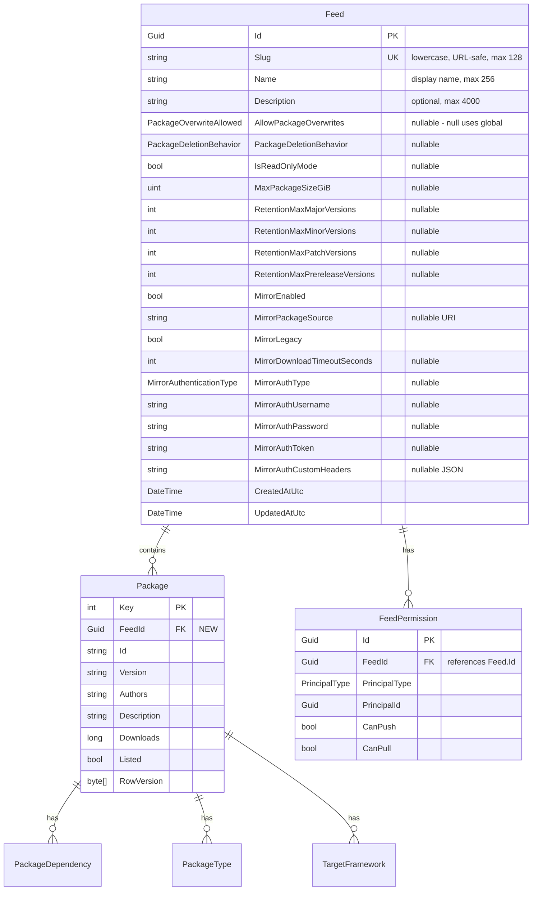
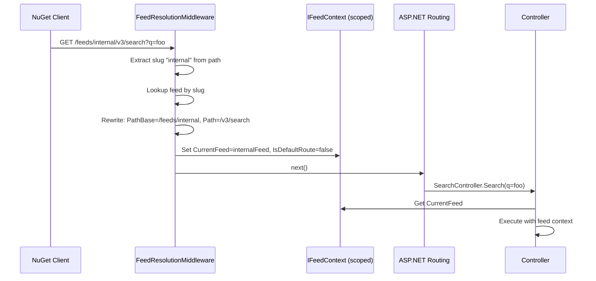
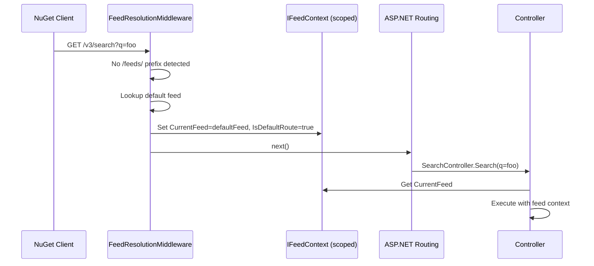
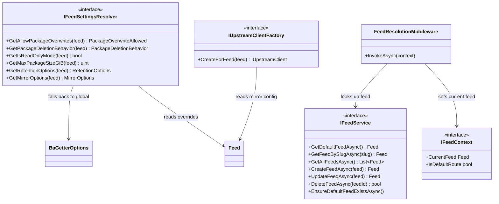

# Multi-Feed Support Implementation Plan (PLAT-671)

## 1. Overview

BaGetter is currently a single-feed NuGet server. All packages, storage, search, and permissions operate against a hardcoded `"default"` feed. This plan adds support for hosting multiple isolated NuGet feeds from a single BaGetter instance, so packages can be separated per team, customer, or purpose.

### Goals

- Each feed is a fully independent NuGet V3 endpoint with its own packages, storage, and settings
- Backward compatibility: existing root URLs (`/v3/index.json`, etc.) continue to work as the default feed
- Per-feed configurable settings (overwrite policy, retention, mirror, etc.) via WebUI
- Feed management through Admin UI and REST API
- Per-feed upstream mirroring from day one
- Package storage uses separate subfolders per feed (no deduplication)

### What Changes

| Layer | Current | After |
|-------|---------|-------|
| Data model | No Feed entity; Package has no feed association | `Feed` entity; `Package.FeedId` FK |
| URLs | `/v3/index.json` (global) | Root = default feed; `/feeds/{slug}/v3/index.json` = named feed |
| Storage | `packages/{id}/{version}/` | `packages/{feedSlug}/{id}/{version}/` |
| Search | Global query over all packages | Filtered by feed |
| Permissions | Hardcoded `"default"` string feed ID | `FeedPermission.FeedId` is Guid FK to `Feed.Id`, resolved from URL |
| Settings | Global only (`appsettings.json`) | Global defaults + per-feed overrides stored in DB |
| Mirroring | Single global upstream | Per-feed upstream configuration |

---

## 2. Key Architecture Decisions

| Decision | Choice | Rationale |
|----------|--------|-----------|
| Feed identifier in URLs | Path-based slug: `/feeds/{slug}/...` | Clean, standard (matches Azure DevOps Artifacts pattern), works with any reverse proxy |
| Backward compat | Root URLs map to default feed | Existing NuGet client configs keep working without changes |
| Default feed seeding | Startup check, auto-create if missing | Guarantees the default feed always exists |
| Package isolation | `(FeedId, Id, Version)` unique constraint | Same package ID+version can exist independently in different feeds |
| Storage isolation | Subfolder per feed slug | No deduplication; simple, predictable, easy to manage |
| Settings inheritance | Nullable per-feed overrides; null = use global | Clean override pattern; UI shows "Use global default" option |
| FeedPermission.FeedId | Change from `string` to `Guid` referencing `Feed.Id` | Proper FK relationship; migration looks up the default feed's Guid by slug to convert existing records |
| Feed context propagation | `IFeedContext` (scoped) + explicit `feedId` params on data layer | Middleware sets context; data services are explicit and testable |

---

## 3. URL Structure

### Default Feed (backward compatible)

All existing URLs continue to work unchanged, mapped to the default feed:

```
GET   /v3/index.json
PUT   /api/v2/package
GET   /v3/search
GET   /v3/registration/{id}/index.json
GET   /v3/package/{id}/{version}/{idVersion}.nupkg
...etc (all current endpoints)
```

### Named Feed

All the above endpoints are also available under `/feeds/{slug}/`:

```
GET   /feeds/{slug}/v3/index.json
PUT   /feeds/{slug}/api/v2/package
GET   /feeds/{slug}/v3/search
...etc
```

### Feed Management API (Admin)

```
GET    /api/v1/feeds                → List all feeds
GET    /api/v1/feeds/{slug}         → Get feed details + settings
POST   /api/v1/feeds                → Create feed
PUT    /api/v1/feeds/{slug}         → Update feed settings
DELETE /api/v1/feeds/{slug}         → Delete feed (non-default only)
```

### Web UI

```
/                                  → Default feed package browser (unchanged)
/feeds/{slug}                      → Named feed package browser
/Admin/Feeds                       → Feed management page
/Admin/Feeds/{slug}/Settings       → Per-feed settings editor
```

---

## 4. Data Model Changes

### New Entity: Feed



### Package Entity Changes

- Add `Guid FeedId` (FK to Feed) and `Feed` navigation property
- Change unique constraint from `(Id, Version)` to `(FeedId, Id, Version)`
- Update index on `Id` to `(FeedId, Id)` for efficient per-feed queries

### FeedPermission Entity Changes

`FeedPermission.FeedId` changes from `string` to `Guid`, becoming a proper FK to `Feed.Id`. The migration must:
1. Create a temporary Guid column
2. Map existing `"default"` string values to the default feed's Guid (looked up via `SELECT Id FROM Feeds WHERE Slug = 'default'`)
3. Drop the old string column and rename the new one
4. Add the FK constraint and update the unique index to `(FeedId, PrincipalType, PrincipalId)`

The `IPermissionService` methods change their `string feedId` parameter to `Guid feedId`. Callers (controllers, `FeedPermissionHandler`) pass `_feedContext.CurrentFeed.Id` instead of the feed slug.

The `Feed` entity gains a `List<FeedPermission> Permissions` navigation property.

### AbstractContext Changes

- Add `DbSet<Feed> Feeds` property
- Add `BuildFeedEntity` configuration in `OnModelCreating`
- Update `BuildPackageEntity` with new indexes

---

## 5. Feed Resolution Layer

### Request Flow





### IFeedContext

A scoped service set by middleware providing:
- `Feed CurrentFeed` — the resolved feed for the current request (never null after middleware)
- `bool IsDefaultRoute` — whether the request came in on root URLs (controls URL generation)

### PathBase Trick for URL Generation

By setting `PathBase` to `/feeds/{slug}` in middleware, the existing `BaGetterUrlGenerator` (which uses ASP.NET `LinkGenerator`) automatically produces correct feed-scoped URLs in service index responses — **no code changes needed** in `BaGetterUrlGenerator`.

### Default Feed Seeding

On every startup (after migrations), `IFeedService.EnsureDefaultFeedExistsAsync()` checks if a feed with slug `"default"` exists. If not, it creates one with a normal auto-generated Guid. The slug `"default"` is the stable identifier — code always looks up by slug via `Feed.DefaultSlug` constant, never by a hardcoded Guid.

---

## 6. Core Service Architecture

### Class Relationships



### Changes to Existing Service Interfaces

```mermaid
classDiagram
    class IPackageDatabase {
        <<interface>>
        +AddAsync(package) PackageAddResult
        +ExistsAsync(feedId, id) bool
        +ExistsAsync(feedId, id, version) bool
        +FindAsync(feedId, id, includeUnlisted) List~Package~
        +FindOrNullAsync(feedId, id, version, includeUnlisted) Package
        +UnlistPackageAsync(feedId, id, version) bool
        +RelistPackageAsync(feedId, id, version) bool
        +AddDownloadAsync(feedId, id, version)
        +HardDeletePackageAsync(feedId, id, version) bool
    }
    note for IPackageDatabase "All query methods gain Guid feedId parameter.\nAddAsync relies on Package.FeedId being set."

    class IPackageStorageService {
        <<interface>>
        +SavePackageContentAsync(feedSlug, package, streams...)
        +GetPackageStreamAsync(feedSlug, id, version) Stream
        +GetNuspecStreamAsync(feedSlug, id, version) Stream
        +GetReadmeStreamAsync(feedSlug, id, version) Stream
        +GetIconStreamAsync(feedSlug, id, version) Stream
        +DeleteAsync(feedSlug, id, version)
    }
    note for IPackageStorageService "All methods gain string feedSlug parameter.\nStorage paths: packages/{feedSlug}/{id}/{version}/"

    class IPackageIndexingService {
        <<interface>>
        +IndexAsync(feedId, feedSlug, packageStream) PackageIndexingResult
    }
    note for IPackageIndexingService "Gains feedId and feedSlug parameters.\nSets Package.FeedId before saving."

    class ISearchService {
        <<interface>>
        +SearchAsync(request) SearchResponse
        +AutocompleteAsync(request) AutocompleteResponse
        +ListPackageVersionsAsync(request) AutocompleteResponse
        +FindDependentsAsync(feedId, packageId) DependentsResponse
    }
    note for ISearchService "SearchRequest, AutocompleteRequest, VersionsRequest\ngain Guid FeedId property.\nAll queries filtered by feed."

    class IPackageDeletionService {
        <<interface>>
        +TryDeletePackageAsync(feedId, feedSlug, id, version) bool
        +DeleteOldVersionsAsync(feedId, feedSlug, package, retentionParams) int
    }

    class IPackageContentService {
        <<interface>>
        +GetPackageVersionsOrNullAsync(feedId, feedSlug, id) PackageVersionsResponse
        +GetPackageContentStreamOrNullAsync(feedId, feedSlug, id, version) Stream
        +GetPackageManifestStreamOrNullAsync(...) Stream
        +GetPackageReadmeStreamOrNullAsync(...) Stream
        +GetPackageIconStreamOrNullAsync(...) Stream
    }

    class IPackageMetadataService {
        <<interface>>
        +GetRegistrationIndexOrNullAsync(feedId, id) Response
        +GetRegistrationLeafOrNullAsync(feedId, id, version) Response
    }
```



### Per-Feed Settings Resolution

Each setting on the `Feed` entity is nullable. The `IFeedSettingsResolver` checks the feed's value first; if null, falls back to the global value from `IOptionsSnapshot<BaGetterOptions>`. The UI shows a "Use global default" checkbox per setting.

### Per-Feed Mirroring

`IUpstreamClientFactory` replaces the single `IUpstreamClient` in DI. It creates the appropriate V2/V3 upstream client based on each feed's mirror settings, or returns `NullUpstreamClient` if mirroring is disabled. Clients are cached by feed ID.

`PackageService` uses the factory: on cache-miss, it calls `_upstreamFactory.CreateForFeed(feed)` to get the right client for the current feed.

### Symbol Storage/Indexing

`ISymbolStorageService` and `ISymbolIndexingService` follow the same pattern — gain a `feedSlug` parameter. Symbol files stored under `symbols/{feedSlug}/{file}/{key}/{file2}`.

---

## 7. Authentication & Authorization Changes

### FeedPermissionHandler

Replace the hardcoded `DefaultFeedId = "default"` with `_feedContext.CurrentFeed.Id` (Guid). The handler already receives the permission type (Pull/Push/Admin); now it uses the resolved feed's Guid from the request context. `IPermissionService.CanPushAsync` and `CanPullAsync` change their `string feedId` parameter to `Guid feedId`.

### Controller Auth

`PackagePublishController` and `SymbolController` have private `AuthorizePushAsync` methods that hardcode `DefaultFeedId`. These switch to `_feedContext.CurrentFeed.Id`. No structural change — just replacing the constant with the feed context value.

---

## 8. Web UI Changes

### Feed Management (Admin)

**New page `Admin/Feeds`**: List all feeds (slug, name, package count, created date). Create/edit/delete feeds. Cannot delete the default feed.

**New page `Admin/FeedSettings`**: Per-feed settings editor with sections:
- **General**: Name, description, read-only mode
- **Package Behavior**: Overwrite policy, deletion behavior, max package size
- **Retention**: Max versions per major/minor/patch/prerelease
- **Mirror**: Enable/disable, package source URL, v2/v3, timeout, authentication

Each setting shows a "Use global default" checkbox. When unchecked, the per-feed value becomes editable.

### Feed-Scoped Package Views

Existing Razor pages become feed-aware:
- **Index/Package/Upload/Statistics**: Get current feed from `IFeedContext`, scope queries and links accordingly
- **Layout**: Add a feed selector dropdown in nav bar (hidden when only default feed exists)

---

## 9. Database Migration Strategy

### Migration Steps

1. **Create `Feeds` table** with all columns
2. **Seed default feed** with slug `"default"` and an auto-generated Guid (using `NEWID()` / `randomblob()` depending on provider)
3. **Add `FeedId` column to `Packages`** as nullable Guid, backfill all existing rows with `(SELECT Id FROM Feeds WHERE Slug = 'default')`, then make it non-nullable. Add FK to `Feeds.Id`
4. **Drop old unique constraint** `(Id, Version)`, create new one `(FeedId, Id, Version)`
5. **Migrate `FeedPermission.FeedId`** from `string` to `Guid`: add a new Guid column, map existing `"default"` values to the default feed's Guid via subquery, drop the old string column, rename, add FK to `Feeds.Id`, recreate unique index `(FeedId, PrincipalType, PrincipalId)`

### Creating Migrations

Migrations **must** be generated using the `dotnet ef` CLI — do not write migration files by hand. After making entity/context changes, run for each database provider:

```bash
dotnet ef migrations add AddMultiFeedSupport --project src/BaGetter.Database.Sqlite --startup-project src/BaGetter
dotnet ef migrations add AddMultiFeedSupport --project src/BaGetter.Database.SqlServer --startup-project src/BaGetter
dotnet ef migrations add AddMultiFeedSupport --project src/BaGetter.Database.PostgreSql --startup-project src/BaGetter
dotnet ef migrations add AddMultiFeedSupport --project src/BaGetter.Database.MySql --startup-project src/BaGetter
```

The generated migration will need manual editing to add the data migration step (backfilling `FeedId` on existing packages and seeding the default feed row). This is the only acceptable hand-edit to migration files.

### Storage Migration

Existing files at `packages/{id}/{version}/` need to be under `packages/default/{id}/{version}/`.

**Approach**: Compatibility fallback — if a file isn't found at `packages/{feedSlug}/{id}/{version}/...`, also check the legacy path `packages/{id}/{version}/...`. This allows zero-downtime upgrades without a separate migration step. Mark the fallback for removal in a future version.

For **file storage**: Optionally move directories at startup.
For **cloud storage**: The fallback avoids expensive object-copy operations.

### Global Mirror Config Migration

On first startup after migration, if the global `Mirror` config has `Enabled = true`, copy those settings to the default feed's mirror columns in the DB. This preserves existing mirror behavior.

---

## 10. Implementation Phases

### Phase 1: Data Foundation
Feed entity, Package.FeedId, database migration, default feed seeding.

**Files**: `Feed.cs` (new), `Package.cs`, `AbstractContext.cs`, EF migrations per provider, `IFeedService`/`FeedService` (new), `Program.cs`

**Verify**: Build passes, migrations apply, default feed exists after startup.

### Phase 2: Feed Resolution & Context
Middleware resolves feed from URL, scoped `IFeedContext` available to all services.

**Files**: `IFeedContext`/`FeedContext` (new), `FeedResolutionMiddleware` (new), `Startup.cs`

**Verify**: Root URLs resolve default feed; `/feeds/{slug}/` resolves named feed; unknown slugs → 404.

### Phase 3: Core Service Changes — Data Layer
All package data operations are feed-scoped.

**Files**: `IPackageDatabase`, `PackageDatabase`, `DatabaseSearchService`, `ISearchService`, `IPackageContentService`, `IPackageMetadataService` + implementations

**Verify**: Same package ID in different feeds is independent.

### Phase 4: Storage Changes
Package files stored under feed-specific subdirectories with legacy fallback.

**Files**: `IPackageStorageService`, `PackageStorageService`, `ISymbolStorageService`, symbol storage impl

**Verify**: New packages at `packages/{feedSlug}/...`. Legacy path fallback works.

### Phase 5: Indexing & Deletion Pipeline
Package indexing and deletion are feed-aware.

**Files**: `IPackageIndexingService`, `PackageIndexingService`, `IPackageDeletionService`, `PackageDeletionService`, `ISymbolIndexingService`

**Verify**: Push a package to a specific feed; correct storage and indexing.

### Phase 6: Controller Integration
All NuGet protocol controllers use `IFeedContext`.

**Files**: All controllers (`ServiceIndex`, `PackagePublish`, `PackageContent`, `PackageMetadata`, `Search`, `Symbol`)

**Verify**: End-to-end NuGet operations via root URLs and `/feeds/{slug}/` URLs.

### Phase 7: Authentication & Authorization
Permission checks use dynamic feed slug.

**Files**: `FeedPermissionHandler`, `PackagePublishController`, `SymbolController`

**Verify**: Users with push on feed A cannot push to feed B.

### Phase 8: Per-Feed Settings
Feed settings override global config.

**Files**: `IFeedSettingsResolver`/`FeedSettingsResolver` (new), `PackageIndexingService`, other services reading from `BaGetterOptions`

**Verify**: Per-feed overwrite policy and retention work independently.

### Phase 9: Per-Feed Mirroring
Each feed can mirror a different upstream source.

**Files**: `IUpstreamClientFactory`/`UpstreamClientFactory` (new), `PackageService`, startup mirror config migration

**Verify**: Feed A mirrors nuget.org; Feed B has mirroring disabled.

### Phase 10: Web UI — Feed Management
Admin CRUD for feeds and per-feed settings.

**Files**: `Admin/Feeds.cshtml` (new), `Admin/FeedSettings.cshtml` (new), `_Layout.cshtml`

**Verify**: Full feed CRUD; settings editable with "Use global default" option.

### Phase 11: Web UI — Feed-Scoped Views
Package browser, details, upload, and stats are feed-aware.

**Files**: `Index.cshtml`, `Package.cshtml`, `Upload.cshtml`, `Statistics.cshtml` + code-behind files

**Verify**: Navigating between feeds shows different packages.

### Phase 12: Feed Management REST API
Programmatic feed management.

**Files**: `FeedController.cs` (new)

**Verify**: CRUD via API with proper auth enforcement.

### Phase 13: Dead Code Cleanup
Remove code that becomes orphaned after multi-feed implementation.

Known dead code to remove:
- `private const string DefaultFeedId = "default"` in `PackagePublishController`, `SymbolController`, and `FeedPermissionHandler` — replaced by `IFeedContext.CurrentFeed.Id`
- The single `IUpstreamClient` DI registration in startup — replaced by `IUpstreamClientFactory`
- Global `MirrorOptions` binding if all mirror config moves to per-feed DB storage (evaluate whether to keep as fallback defaults)
- Any direct `IOptionsSnapshot<BaGetterOptions>` usage in services that now use `IFeedSettingsResolver` for feed-scoped settings (e.g., overwrite policy, retention, read-only mode reads in `PackageIndexingService`)
- Unused `string feedId` overloads on `IPermissionService` after the parameter type changes to `Guid`

Each phase should verify no orphaned imports, unused parameters, or unreachable code paths are left behind. Run `dotnet build` with warnings-as-errors to catch unused variables.

### Phase 14: Integration Tests & Polish
Comprehensive test coverage for all phases.

Key scenarios: default feed backward compat, named feed operations, feed isolation, per-feed settings, per-feed mirroring, permission enforcement, storage paths, service index URLs, upgrade migration.

---

## Appendix: Files Changed Summary

### New Files

| File | Purpose |
|------|---------|
| `src/BaGetter.Core/Entities/Feed.cs` | Feed entity |
| `src/BaGetter.Core/Feeds/IFeedService.cs` | Feed CRUD interface |
| `src/BaGetter.Core/Feeds/FeedService.cs` | Feed CRUD implementation |
| `src/BaGetter.Core/Feeds/IFeedContext.cs` | Current request feed context interface |
| `src/BaGetter.Core/Feeds/FeedContext.cs` | Mutable scoped implementation |
| `src/BaGetter.Core/Feeds/IFeedSettingsResolver.cs` | Per-feed settings resolution interface |
| `src/BaGetter.Core/Feeds/FeedSettingsResolver.cs` | Implementation |
| `src/BaGetter.Core/Upstream/IUpstreamClientFactory.cs` | Per-feed upstream client factory |
| `src/BaGetter.Core/Upstream/UpstreamClientFactory.cs` | Implementation |
| `src/BaGetter.Web/Middleware/FeedResolutionMiddleware.cs` | URL-to-feed resolution |
| `src/BaGetter.Web/Controllers/FeedController.cs` | Feed management REST API |
| `src/BaGetter.Web/Pages/Admin/Feeds.cshtml` | Feed management UI |
| `src/BaGetter.Web/Pages/Admin/FeedSettings.cshtml` | Per-feed settings UI |
| `src/BaGetter.Database.*/Migrations/...` | DB migrations per provider |

### Modified Files

| File | Change |
|------|--------|
| `src/BaGetter.Core/Entities/Package.cs` | Add FeedId, Feed navigation |
| `src/BaGetter.Core/Entities/AbstractContext.cs` | Add Feeds DbSet, update model config |
| `src/BaGetter.Core/IPackageDatabase.cs` | Add feedId params to all methods |
| `src/BaGetter.Core/PackageDatabase.cs` | Filter all queries by feedId |
| `src/BaGetter.Core/Search/DatabaseSearchService.cs` | Filter by feedId |
| `src/BaGetter.Core/Search/ISearchService.cs` | Add FeedId to request models |
| `src/BaGetter.Core/Storage/IPackageStorageService.cs` | Add feedSlug param |
| `src/BaGetter.Core/Storage/PackageStorageService.cs` | Feed-prefixed paths |
| `src/BaGetter.Core/Indexing/IPackageIndexingService.cs` | Add feed params |
| `src/BaGetter.Core/Indexing/PackageIndexingService.cs` | Feed-aware indexing |
| `src/BaGetter.Core/Indexing/IPackageDeletionService.cs` | Add feed params |
| `src/BaGetter.Core/Content/IPackageContentService.cs` | Add feed params |
| `src/BaGetter.Core/Metadata/IPackageMetadataService.cs` | Add feed params |
| `src/BaGetter.Core/PackageService.cs` | Per-feed mirroring |
| `src/BaGetter.Web/Controllers/*.cs` | Use IFeedContext (all 6 controllers) |
| `src/BaGetter.Core/Entities/FeedPermission.cs` | FeedId from string to Guid FK |
| `src/BaGetter.Core/Authentication/IPermissionService.cs` | feedId param from string to Guid |
| `src/BaGetter.Core/Authentication/PermissionService.cs` | feedId param from string to Guid |
| `src/BaGetter.Web/Authentication/FeedPermissionHandler.cs` | Dynamic feed Guid from IFeedContext |
| `src/BaGetter.Web/Pages/*.cshtml` | Feed-scoped views (Index, Package, Upload, Statistics) |
| `src/BaGetter.Web/Pages/Shared/_Layout.cshtml` | Feed selector in nav |
| `src/BaGetter/Startup.cs` | Register feed services, middleware |
| `src/BaGetter/Program.cs` | Default feed seeding |
